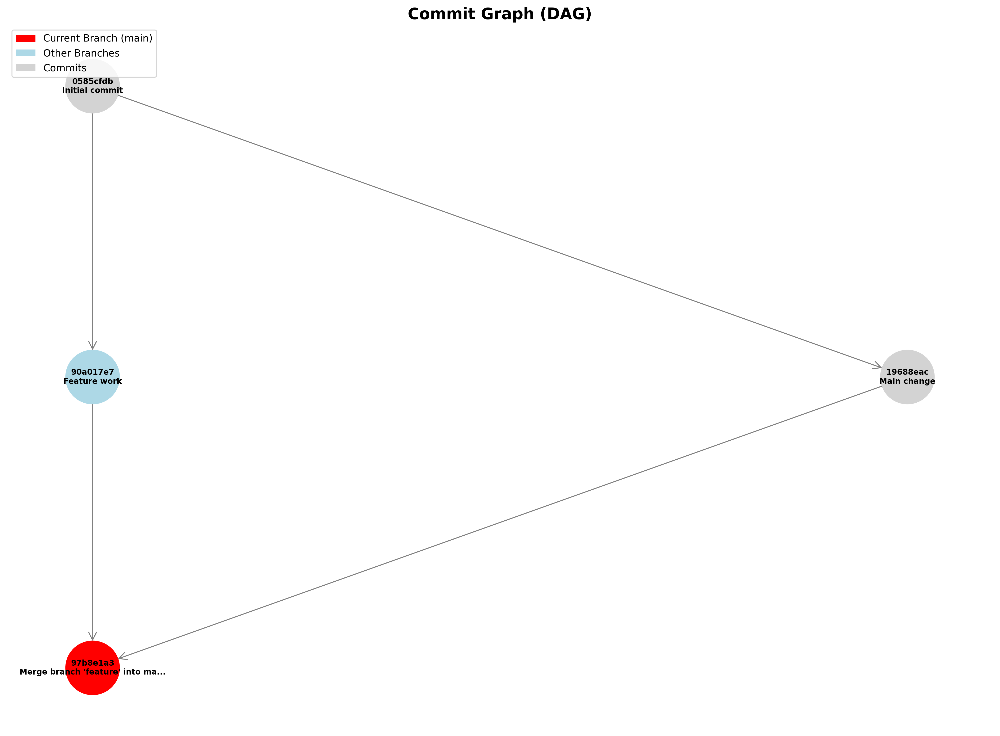

# USER GUIDE — VCS (Git‑like Version Control System)

Audience: Students and beginners exploring how a version control system works and how to use this project effectively.

This guide is standalone and complete: quick command reference first, then detailed explanations of how it works (data structures and algorithms), with examples, diagrams, tips, and troubleshooting.

---

## 🔑 Quick Reference (Cheat Sheet)

All commands run from the project folder. Use Python explicitly (Windows PowerShell):

```powershell
python .\main.py <command> [options]
```

- Initialize repository
  - `python .\main.py init`
- Stage files (add to staging area)
  - `python .\main.py add <file1> [file2 ...]`
- Commit staged changes
  - `python .\main.py commit -m "message" [-a "Author Name"]`
- Show status
  - `python .\main.py status`
- Show history (log)
  - `python .\main.py log [-n 5]`
- Create and list branches
  - `python .\main.py branch <name>`
  - `python .\main.py branches`
- Switch branch
  - `python .\main.py checkout <name>`
- Merge branch into current
  - `python .\main.py merge <name>`
- Roll back N commits (default 1)
  - `python .\main.py rollback [N]`
- Visualize commit graph
  - `python .\main.py graph [-o commits.png] [--format dot|png]`
- View audit log
  - `python .\main.py audit`
- Help
  - `python .\main.py help`

---

## 🚀 Getting Started (5–10 min)

1) Install requirements (Python 3.7+). Optional for visualization:
```powershell
pip install -r .\requirements.txt
```

2) Initialize a repository in your working folder:
```powershell
python .\main.py init
```
Example output:
```
Repository initialized at C:\path\to\your\folder\.vcs
Current branch: main
```

3) Create and stage files:
```powershell
ni hello.txt -Value "Hello VCS"
python .\main.py add hello.txt
```

4) Commit changes:
```powershell
python .\main.py commit -m "Initial commit" -a "Alice"
```

5) View history and status:
```powershell
python .\main.py log
python .\main.py status
```

6) Branch, switch, and merge:
```powershell
python .\main.py branch feature-x
python .\main.py checkout feature-x
Add-Content hello.txt "`nFeature line"
python .\main.py add hello.txt
python .\main.py commit -m "Add feature line" -a "Alice"
python .\main.py checkout main
python .\main.py merge feature-x
```

7) Visualize (optional):
```powershell
python .\main.py graph -o commits.png
```

---

## 🧠 How It Works (Concepts)

This VCS implements core Git concepts with educational clarity and secure data structures.

- Commits form a Directed Acyclic Graph (DAG): each commit points to one or more parents.
- Each commit snapshot is secured with SHA‑256 and a Merkle Tree of files for integrity.
- Branches are simple pointers (names) to commit hashes.
- A stack supports rollback of recent commits.

### DAG of Commits

```
main:   A ── B ── C
                 \
feature:          D ── E
                   \  /
                     M   (merge commit with two parents)
```
- Nodes are commits (A, B, C, D, E, M)
- Edges point from child to parent(s)
- No cycles → acyclic

### Merkle Tree (File Integrity)

- Leaves: hash(filename:content)
- Internal node: hash(left.hash + right.hash)
- Root hash summarizes all files; any change alters the root.

```
         Root
       /      \
     H12      H34
    /  \     /  \
   H1  H2   H3  H4   (H1..H4 are per‑file hashes)
```

### SHA‑256 Commit Hash

Each commit’s ID is the SHA‑256 of its structured data:
- Parents’ hashes
- Merkle root of the files
- Message, author, timestamp

Change anything → different hash → tamper detection.

### Key Data Structures (in code)

- Hash maps (dict): commits, branches, staging area
- Adjacency list (dict): commit graph relationships
- Stack (list): rollback history
- Binary tree: MerkleTree

Time complexity highlights:
- Add file: O(m) per file (m = file size)
- Commit: O(n) files in snapshot
- Lookup commit: O(1)
- Verify Merkle proof: O(log n)

---

## 🛠️ Detailed Command Guide

Below are common commands with usage, options, and example outputs (illustrative).

### init — Initialize repository
```powershell
python .\main.py init
```
Creates `.vcs` folder structure and sets current branch to `main`.

### add — Stage files for commit
```powershell
python .\main.py add file1.txt file2.py
```
Stages one or more files. Re‑run after editing to stage new changes.

Example output:
```
Staged: file1.txt
Staged: file2.py
```

### commit — Create a new snapshot
```powershell
python .\main.py commit -m "Message" -a "Author"
```
- `-m/--message` (required): commit message
- `-a/--author` (optional): author name (default "default")

Example output:
```
Commit created: 0f1a2b3 (author: Alice)
Message: Add feature line
Parents: 1
Merkle root: 8c9d...
```

### status — See what’s staged and current branch
```powershell
python .\main.py status
```
Shows current branch, HEAD commit, staged files, etc.

### log — View commit history
```powershell
python .\main.py log
python .\main.py log -n 5
```
Displays latest commits (optionally limited).

### branch / branches — Create or list branches
```powershell
python .\main.py branch feature-x
python .\main.py branches
```
`branches` shows all branches and their heads.

### checkout — Switch branches
```powershell
python .\main.py checkout feature-x
```
Updates working state to branch head.

### merge — Merge a branch into current
```powershell
python .\main.py merge feature-x
```
- Finds Lowest Common Ancestor (LCA)
- Detects conflicts if both changed same file differently
- Creates a merge commit with two parents

Conflict example output:
```
Merge conflict detected in 1 file(s): hello.txt
Please resolve manually, then add and commit.
```

### rollback — Undo last N commits
```powershell
python .\main.py rollback      # default N=1
python .\main.py rollback 3
```
Uses a stack of previous commits to move HEAD back and restore files.

### graph — Visualize commit DAG
```powershell
python .\main.py graph -o commits.png           # PNG (requires networkx+matplotlib)
python .\main.py graph --format dot -o g.dot    # DOT format for Graphviz
```

Sample: Commit Graph (auto-generated)



The sample above was generated by initializing a small repo, creating a feature branch, making changes on both branches, merging back to main, and then running `graph`.

### audit — Show operation history
```powershell
python .\main.py audit
```
Displays actions recorded by the repository’s audit trail.

---

## 📚 Tutorials and Workflows

### A. Basic Workflow
```powershell
python .\main.py init
ni a.txt -Value "A1"
python .\main.py add a.txt
python .\main.py commit -m "Add a.txt" -a "You"
python .\main.py log
```

### B. Feature Branching and Merge
```powershell
# on main
python .\main.py branch feature
python .\main.py checkout feature
Add-Content a.txt "`nFeature change"
python .\main.py add a.txt
python .\main.py commit -m "Feature change"

python .\main.py checkout main
python .\main.py merge feature
python .\main.py log
```

### C. Handling Merge Conflicts (Manual Resolution)
1) Both branches modified the same lines in a file.
2) Merge reports conflicts.
3) Open the conflicted file(s), resolve by choosing/combining content.
4) Stage and commit the resolution:
```powershell
python .\main.py add <conflicted-file>
python .\main.py commit -m "Resolve merge conflict"
```

### D. Rollback Recent Commits
```powershell
python .\main.py rollback       # undo last commit
python .\main.py rollback 2     # undo last two commits
```

### E. Demo and Tests
```powershell
python .\demo.py       # runs a scripted demo
python .\test_vcs.py   # runs tests (if present)
```

---

## 🔍 Internals (Deeper Dive)

### Repository (repository.py)
- `commits: Dict[hash, Commit]` — O(1) lookup
- `commit_graph: Dict[hash, List[hash]]` — DAG via adjacency list
- `branches: Dict[name, hash]` — branch heads
- `staging_area: Dict[file, content]`
- `rollback_stack: List[hash]`

Persistence under `.vcs/` (commits, objects, refs). Audit log records operations.

### Commit (commit.py)
- Snapshot of files at a point in time
- Parents (0+): supports merge commits
- Merkle tree root for files
- SHA‑256 commit hash of structured data

### Merkle Tree (merkle_tree.py)
- Hashes leaves (file entries) and builds up to a root
- Efficient verification of inclusion and tamper detection

### Algorithms
- LCA for merges: mark ancestors of one, traverse the other → first hit is LCA
- Conflict detection: compare each file vs ancestor; mark when both diverged

---

## 🧭 Mapping to Git (Mental Model)

| This VCS | Git command | Notes |
|---|---|---|
| `init` | `git init` | Initialize repo |
| `add` | `git add` | Stage files |
| `commit -m` | `git commit -m` | Create commit |
| `status` | `git status` | Show state |
| `log` | `git log` | History |
| `branch <n>` | `git branch <n>` | Create branch |
| `branches` | `git branch --list` | List branches |
| `checkout <n>` | `git checkout <n>` | Switch branch |
| `merge <n>` | `git merge <n>` | Merge branch |
| `rollback [N]` | `git reset --hard HEAD~N` | Simplified rollback |
| `graph` | `git log --graph` | Visualization analogue |
| `audit` | N/A | Extra: operation trail |

Limitations vs Git: no remotes, no staging by hunk, simpler merge strategy, local only.

---

## ❗ Troubleshooting

- "Error: Not a VCS repository"
  - Run `python .\main.py init` in the folder that contains your files.
- Merge conflicts
  - Open the listed files, resolve manually, then `add` and `commit`.
- Visualization not working
  - Install optional deps: `pip install networkx matplotlib` and re‑run `graph`.
- Permission/File access issues on Windows
  - Close apps locking the files, or run PowerShell as Administrator.
- Nothing changes after commit
  - Ensure you ran `add` after modifying files. Staging is required before commit.

---

## 🙋 FAQ

- Do I need Git installed? — No, this is a standalone educational VCS.
- Where does data live? — In the hidden `.vcs` folder at your repo root.
- Can I undo a merge? — Yes, with `rollback` if it was the latest commit.
- Does it support remotes? — Not yet (future enhancement idea).

---

## 📘 Glossary

- DAG: Directed Acyclic Graph; commit history structure.
- Commit: A snapshot of project files.
- Branch: A named pointer to a commit.
- Merge: Combine histories; may create a commit with two parents.
- Merkle Tree: Binary tree of hashes for integrity.
- SHA‑256: Cryptographic hash function producing a 64‑hex string.

---

## 🧩 Tips (Windows PowerShell)

- Create file quickly: `ni file.txt -Value "Hello"`
- Append to file: `Add-Content file.txt "`nMore"`
- Show current directory: `pwd`

---

## ✅ Summary

You now have:
- A quick command cheat sheet
- A step‑by‑step workflow to practice
- An understanding of how commits, DAGs, and Merkle Trees work inside this VCS
- Troubleshooting steps and a Git mental model mapping

Explore the code for deeper learning: `repository.py`, `commit.py`, `merkle_tree.py`, `cli.py`. Happy versioning! 🎉
